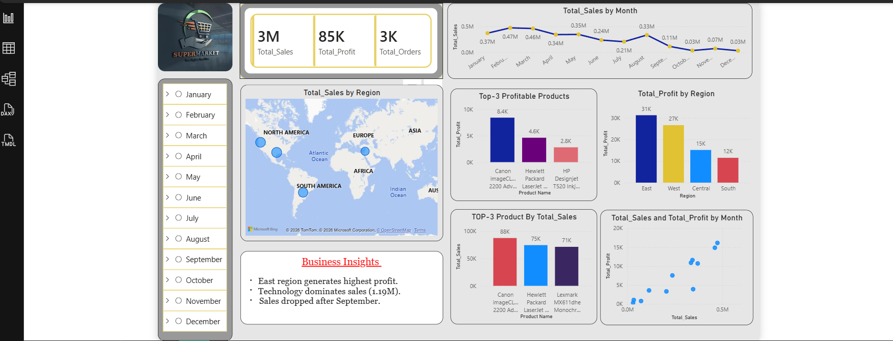

# End-to-End Power BI Dashboard

## Project Overview
This project presents a complete sales analysis dashboard for a supermarket using Power BI.

## Dashboard Preview

## Key Insights
- East region generates the highest profit
- Technology category dominates sales (~1.19M)
- Sales dropped significantly after September

## Features
- Monthly sales trend analysis
- Region-wise performance
- Top 3 profitable products
- Interactive filters (Month-wise)

## Tools Used
- Microsoft Power BI
- Data Visualization
- Data Cleaning

## Files Included
- End To End Project.pbix → Main dashboard file
- dashboard.png → Dashboard preview

## How to Use
1. Download `.pbix` file
2. Open in Power BI Desktop
3. Explore dashboard using filters
